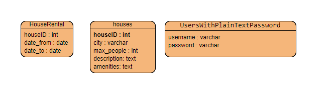

# Flask Housing Booking API

## Overview

Welcome to the Flask House Booking API! This API allows users to explore available houses, filter by various criteria, and book stays. It is built using Flask, interacts with an Azure SQL database, and includes user authentication via JWT tokens.

## Usage

1. **Flask application Deployed at:**

    The application running on `https://flask-app-mehmet.azurewebsites.net/`.

2. **Access the Swagger UI for API documentation:**

    Open your web browser and go to `https://flask-app-mehmet.azurewebsites.net/swagger`.

## API Endpoints

API endpoints described in swagger documentation. 

## Authentication

To access protected endpoints (`/bookstay`), include a JWT token in the request query parameter: `?token=your_token`.

## Assumptions

1. Assumes JWT tokens are passed as query parameters for authentication.

## Encountered Issues

1. Azure deployment
    Resolution: [Microsoft Azure Flask Quickstart Guide](https://learn.microsoft.com/tr-tr/azure/app-service/quickstart-python?tabs=flask%2Cwindows%2Cazure-cli%2Cvscode-deploy%2Cdeploy-instructions-azportal%2Cterminal-bash%2Cdeploy-instructions-zip-azcli).

2. Requirement.txt package management for Azure
    Resolution: [Requirements Dependencies For Python](https://learn.microsoft.com/en-us/azure/azure-functions/functions-reference-python?tabs=asgi%2Capplication-level&pivots=python-mode-decorators)

3. Azure Database Creation
    Resolution: [How to Create A SQL Database](https://learn.microsoft.com/en-us/azure/azure-sql/database/single-database-create-quickstart?view=azuresql&tabs=azure-portal)

## ER-Diagram

I have two different tables to demonstrate basic logic of the project.

## Video Link

    You can reach the presentation of the project on ``
